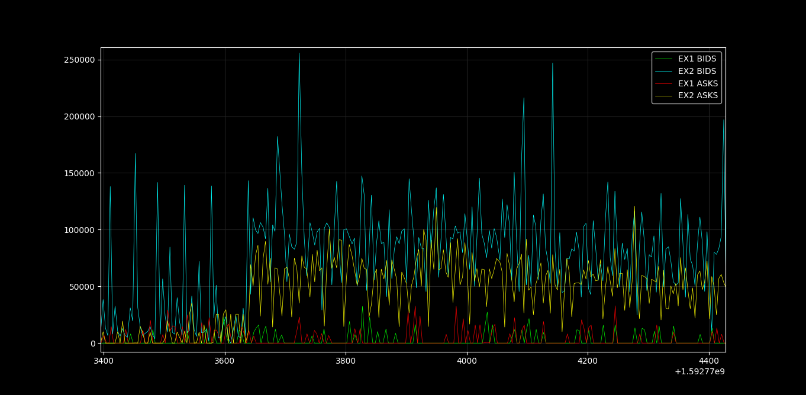

# measurevolume
Measure volume of an exchange based on snapshots of the order book.

This program works by looking for the difference between two snapshots in the order book.

Caution: Exchanges engaged in wash trading will give unreal figures.

Example format of input data (ON CSV):
{'timestamp': 1592726830.0367844,
 'exchange': 'EX1',
 'bids': [['49779.15', '0.02'],
  ['49779.14', '0.00380661'],
  ['49759.14', '0.00380963'],
  ['49720.83', '0.16510258'],
  ['49718.25', '0.32428376'],
  ['49716.18', '0.22748933'],
  ['49714.91', '0.0019994'],
  ['49707.3', '0.17932908'],
  ['49686.75', '0.29004787'],
  ['49675.23', '0.26706538'],
  ['49671.52', '0.15056393'],
  ['49665.48', '0.13145351'],
  ['49661.09', '0.27345399'],
  ['49655.16', '0.20296668'],
  ['49652.71', '0.29826925'],
  ['49642.89', '0.16180376'],
  ['49619.15', '0.13235956'],
  ['49617.07', '0.30968902'],
  ['49614.59', '0.25003382'],
  ['49600', '0.00259258']],
 'asks': [['49860.31', '0.23061707'],
  ['49921.6', '0.25193795'],
  ['49965.46', '0.31090523'],
  ['50005.14', '0.00380017'],
  ['50008.43', '0.24043453'],
  ['50032.48', '0.32876983'],
  ['50037.12', '0.0101191'],
  ['50038.36', '0.28787255'],
  ['50039.21', '0.3342539'],
  ['50049.99', '0.15989852'],
  ['50051.43', '0.1498161'],
  ['50051.98', '0.28642627'],
  ['50056.4', '0.14088338'],
  ['50072.39', '0.32642855'],
  ['50076.07', '0.29134438'],
  ['50077.25', '0.12779206'],
  ['50088.02', '0.17363693'],
  ['50088.08', '0.22554298'],
  ['50091.16', '0.33404024'],
  ['50091.75', '0.23736112']]}
