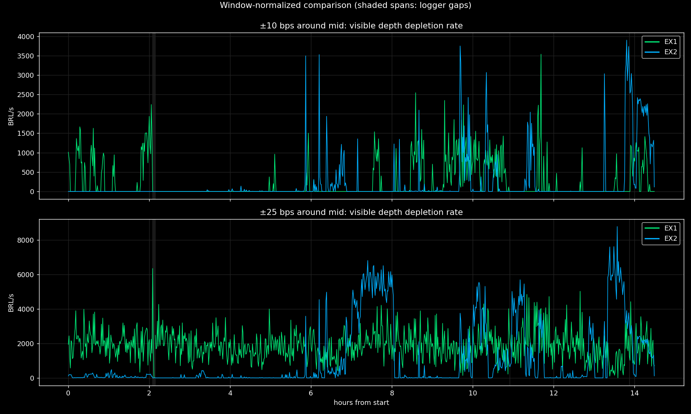
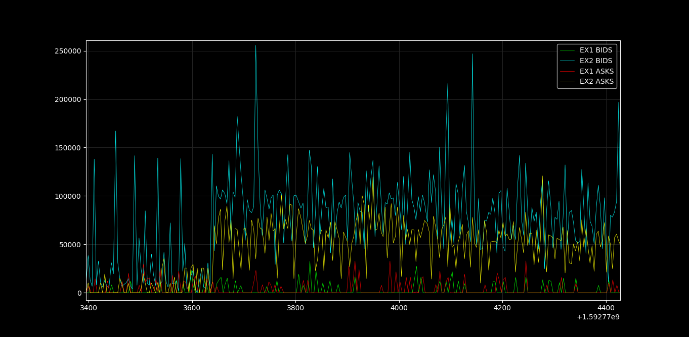
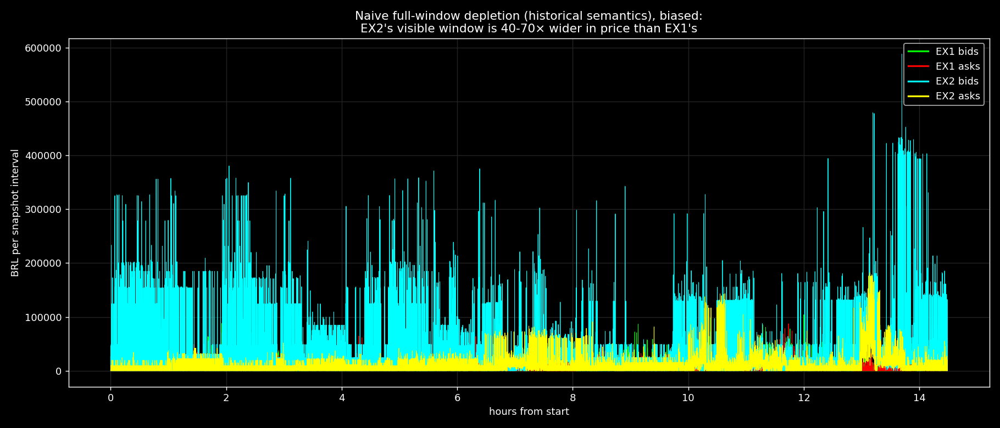
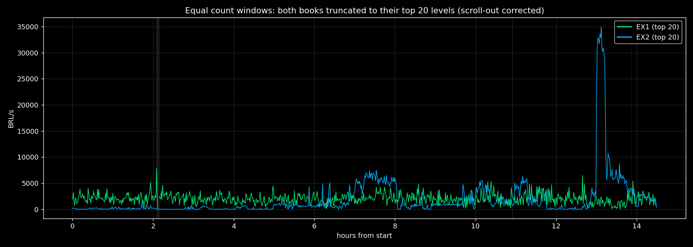
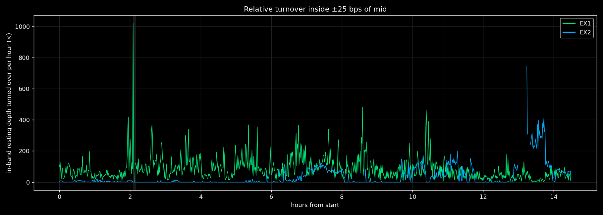

# measurevolume

Estimate market-taker activity on cryptocurrency exchanges from order-book
snapshots, by measuring **visible depth depletion**: resting liquidity that
was observable in one snapshot and is gone in the next.

[](https://github.com/carlosplanchon/measurevolume/actions/workflows/ci.yml)
[](https://github.com/carlosplanchon/measurevolume/blob/master/pyproject.toml)
[](https://opensource.org/licenses/MIT)
[](https://deepwiki.com/carlosplanchon/measurevolume)



## Origins

This project originally grew out of a cross-exchange arbitrage system I
worked on in early 2020. Price differences between venues identified
potential trades, but the spread alone was not enough. Execution also
depended on understanding where buying or selling pressure was building
in the order book. `measurevolume` was developed to estimate that
pressure from successive snapshots by tracking visible depth depletion
and, in particular, activity consistent with market takers consuming
resting orders.

## Why depletion instead of reported volume

Reported (tape) volume is cheap to fake: wash trades print volume without
risking anything. Liquidity that *rests in the visible book and then
disappears* is harder to fake: fake volume that never rests in the visible
window between snapshots does not register here at all. That idea has been
the core of this project since 2020.

## What the number is, and is not

For a level that shrank or vanished between two snapshots, differencing
alone cannot distinguish:

- an **execution** (what we are after),
- a **cancellation**,
- a level **pushed out of the top-N window** by price drift,
- an execution **refilled** before the next snapshot (invisible; the
  estimator undercounts these by construction).

So the estimator is explicit about its epistemics:

- **One-sided far boundary.** In a top-N feed, the absence of a price
  *better* than the current best is informative: a resting order there
  would necessarily be visible. Only the tail beyond the *far* boundary is
  censored, so previous levels beyond it are excluded (unless the window is
  not full, in which case the boundary is the true end of the book).
- **Price bands.** Depletion is measured inside fixed bands around the
  previous mid (default ±10 and ±25 bps), so venues exposing different
  window sizes become comparable. Intervals where a band exceeds the
  observable window are flagged `censored`.
- **Confidence tiers.** Every reduction is classified: `crossed` (the level
  vanished and the best price ended beyond it, meaning the touch moved through it;
  high confidence), `near_touch` (within 5 bps of the previous best), and
  `deep` (deep in the book, most likely a cancellation).
- **Gap flags.** Intervals longer than 15 s (median cadence is ~4 s) are
  flagged `stale` and kept out of clean aggregates.

## The dataset

`ORDER_BOOK.csv.tar.xz`: 25,767 snapshots (~14.5 h) of the BRL/BTC order
books of two cryptocurrency exchanges, June 2020. JSON Lines, one snapshot
per line:

```json
{"timestamp": 1592726829.67, "exchange": "EX2",
 "bids": [[49788.0, 0.06581847], [49763.29, 0.01]],
 "asks": [[49921.6, 0.25193795], [49965.46, 0.31090523]]}
```

Quirks worth knowing (they drove most of the design):

|                        | EX1              | EX2                |
| ---------------------- | ---------------- | ------------------ |
| snapshots              | 12,827           | 12,940             |
| published window       | top-20 per side  | top-1000 per side  |
| typical span from mid  | ±44-48 bps       | -30 % / +15 %      |
| number encoding        | JSON strings     | JSON numbers       |

Median snapshot cadence is ~3.9 s, with logger gaps of up to 64 s. Parsing
goes through `json.loads(..., parse_float=Decimal)`, so no binary float is
ever materialized for book data.

## A story about experimental bias

The original 2020 figure, kept here as an exhibit:



It looks like EX2 dwarfs EX1. Part of that is real, and part is an
artifact: EX1 exposes only ±~45 bps of book while EX2 exposes -30 %/+15 %,
so EX2 contributed **40-70× more price surface** of churn (deep
cancellations included) to the same chart. Reproduced with today's code,
naive full-window semantics:



Normalize the observation windows (fixed bands around the mid, scroll-out
corrected) and the comparison becomes fair:


As a control, truncate both books to the same top-20 levels (which on this
dataset happen to span similar price bands):



And compare venues of very different sizes by *relative* turnover: how
many times the resting in-band depth is turned over per hour:



### What the full run says (14.5 h, clean intervals)

| depletion (BRL)              | EX1     | EX2     |
| ---------------------------- | ------- | ------- |
| naive full window            | 170.8 M | 498.8 M |
| window, scroll-out corrected | 104.9 M | 378.1 M |
| ±25 bps band                 | 97.5 M  | 56.2 M  |
| ±10 bps band                 | 11.9 M  | 10.1 M  |

Three things fall out of the corrected measurement:

- **Scroll-out inflation was everywhere.** 39 % of EX1's naive figure and
  24 % of EX2's was liquidity that merely left the visible window: the
  exact quantity the 2026 refactor had silently started counting.
- **The 2020 conclusion inverts inside comparable bands.** Naively, EX2
  looks ~3× bigger. Within ±25 bps of the mid it is EX1 that shows ~1.7×
  more depletion; ~84 % of EX2's naive figure was deep-book churn across
  its 1000-level window, the kind of reduction most consistent with
  cancellations, not fills. The equal-window control agrees: truncated to
  top-20, the totals come out close (105 M vs 100 M), so the *quantity*
  becomes comparable, but the *character* does not:
- **The tier mix is night and day.** EX1's in-band depletion is 65 %
  `crossed`: levels the best price swept through, the classic taker
  signature. EX2's is 94 % `near_touch` and only 3 % `crossed`: constant
  reshuffling at the best prices that almost never displaces them. EX2
  also runs nearly dark for the first ~6 hours and then switches into
  bursty regimes, while EX1 hums continuously all day.

Snapshots alone cannot say *why* EX2 churns like that (maker cancel/repost
cycles, fills refilled within the ~4 s cadence, or something less organic).
That is what the tape contrast under *future work* is for.

## Usage

Python ≥ 3.10, no runtime dependencies (matplotlib only for figures):

```sh
uv pip install -e ".[plot]"     # or: pip install -e ".[plot]"
```

The CLI reads `.csv`, `.csv.xz` or `.csv.tar.xz` (streamed, never extracted
to disk), always computes the `naive` view (historical semantics), the
`window` view (scroll-out corrected) and one view per band, and prints a
per-tier summary table:

```sh
measurevolume analyze ORDER_BOOK.csv.tar.xz \
    --exchanges EX1 EX2 --bands 10 25 --top-n-control 20 --out figures
```

API:

```python
from measurevolume import AnalysisConfig, MarketAnalyzer

analyzer = MarketAnalyzer(AnalysisConfig(top_n_control=20))
analyzer.analyze("ORDER_BOOK.csv.tar.xz", ["EX1", "EX2"])
for s in analyzer.summaries():
    print(s.exchange, s.profile, s.spec.name, s.clean.total, s.hourly_rate)
```

Or at the estimator level:

```python
from decimal import Decimal
from measurevolume import estimate_depletion

breakdown = estimate_depletion(prev_bids, cur_bids, mid=Decimal("49800"), band_bps=25)
breakdown.crossed, breakdown.near_touch, breakdown.deep
```

## Limitations and future work

- A reduction can be a cancellation; a refilled execution is invisible. At
  ~4 s cadence both effects are material: the tiers bound the ambiguity,
  they do not remove it.
- The right next capture is snapshots **plus** the public trade tape and
  L2 deltas with sequence IDs. Then the interesting number becomes the
  **unexplained tape ratio** (printed volume not explained by resting-book
  depletion) as an anomaly signal consistent with wash trading. That
  signal is only meaningful *comparatively* (same method, same bands, same
  cadence, across venues or periods), never as an absolute figure.

## Lineage

- **2020**: hand-rolled level alignment with an `unmatched_volume`
  heuristic; partially filtered window scroll-out but silently discarded
  fully swept windows.
- **2026 (Feb)**: OOP refactor; the cleaner dict-based diff changed the
  semantics without anyone noticing: every vanished level counted,
  including scroll-out.
- **2026 (Aug)**: the experiment reformulated with a one-sided far boundary,
  window normalization by price bands, confidence tiers, gap handling, and
  the top-20 control. The 2020 chart's hidden bias is now part of the
  story instead of part of the results.

MIT. See [LICENSE](LICENSE).
